# Brique 00 — Installation de l'hyperviseur Proxmox VE 9

> Procédure d'intervention rédigée comme chez un client : chaque étape indique
> **quoi faire**, **pourquoi**, **comment vérifier** et **quoi faire si ça échoue**.

## 1. Besoin du client

La PME doit faire tourner plusieurs serveurs (annuaire, tickets, supervision,
sauvegarde) sans acheter une machine par serveur. On installe un **hyperviseur** :
le logiciel qui découpe une machine physique en plusieurs machines virtuelles (VM).

## 2. Choix de la techno

| Critère | Proxmox VE | VMware ESXi | Microsoft Hyper-V |
| --- | --- | --- | --- |
| Coût | Gratuit (support payant en option) | Payant depuis le rachat par Broadcom | Inclus avec Windows Server |
| Usage en PME | En forte hausse, migrations depuis VMware | Historique, en recul | Très répandu en environnement Microsoft |
| Administration | Interface web, sans client à installer | Interface web | Console Windows |
| Sauvegarde intégrée | Oui | Non (outil tiers) | Partielle |

**Choix retenu : Proxmox VE.** Gratuit, complet, et de plus en plus demandé depuis
la hausse des tarifs VMware. Hyper-V sera abordé plus tard, car il reste très présent
en entreprise.

## 3. Préparation de l'intervention

### 3.1 Relevé du réseau existant

**Pourquoi :** avant d'ajouter un équipement sur un réseau, un technicien relève
l'adressage en place. Une adresse mal choisie provoque un conflit IP et rend
le serveur injoignable.

**Comment :** sur un poste déjà connecté au réseau, ouvrir l'invite de commandes
et taper `ipconfig`.

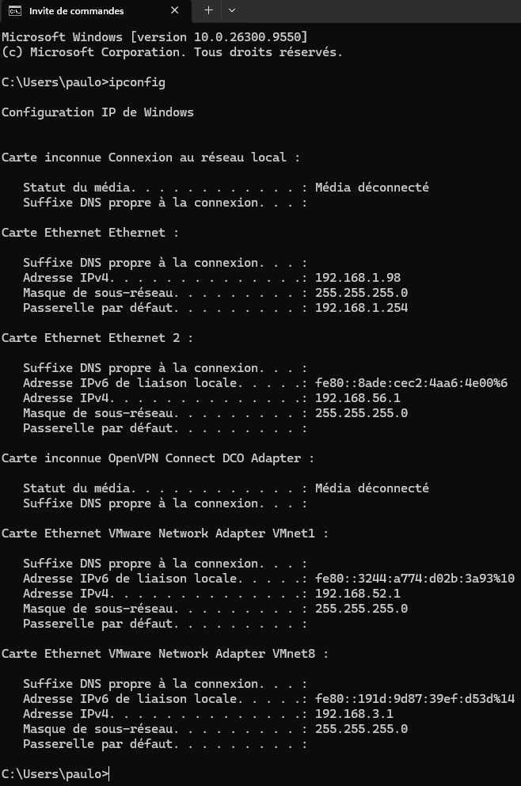

**Lecture du résultat :** seule la carte qui a une **passerelle par défaut** est
la vraie connexion au réseau. Les autres (VirtualBox, VMware, VPN) sont des cartes
virtuelles, sans passerelle.

| Information | Valeur relevée | Signification |
| --- | --- | --- |
| Adresse IPv4 du poste | 192.168.1.98 | Attribuée automatiquement par la box (DHCP) |
| Masque | 255.255.255.0 (/24) | Réseau 192.168.1.0, adresses utilisables de .1 à .254 |
| Passerelle | 192.168.1.254 | La box, sortie vers Internet |

### 3.2 Choix de l'adresse IP fixe du serveur

**Règle :** un serveur a toujours une **adresse IP fixe**, choisie **hors de la
plage DHCP** de la box, pour éviter qu'un autre appareil reçoive la même.

**Vérifications avant de valider l'adresse :**

1. `ping <adresse>` : aucune réponse = l'adresse est libre.
2. Interface de la box → rubrique DHCP : l'adresse doit être hors de la plage distribuée.

**Plage DHCP relevée sur la box (Freebox OS → Paramètres → DHCP) :**

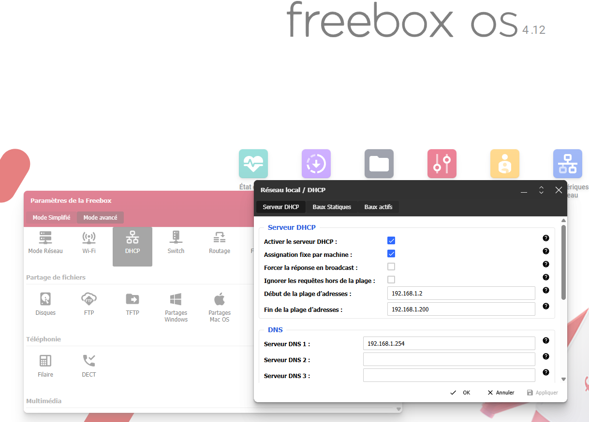

La box distribue les adresses de **192.168.1.2 à 192.168.1.200**. Les adresses
**192.168.1.201 à 192.168.1.253** sont donc libres pour les équipements à IP fixe.

> **Piège évité :** l'adresse 192.168.1.200, proposée au départ, est la dernière de
> la plage DHCP. La box aurait pu la donner à un téléphone et créer un conflit IP.
> D'où l'importance de vérifier la plage avant de choisir.

**Plan d'adresses fixes réservé au lab, sur le réseau de la box :**

| Adresse | Équipement |
| --- | --- |
| 192.168.1.210 | pve01 (administration Proxmox) |
| 192.168.1.211 | pfSense, côté WAN |
| 192.168.1.212 – .220 | Réserve pour la suite du lab |

**Vérification par ping :**

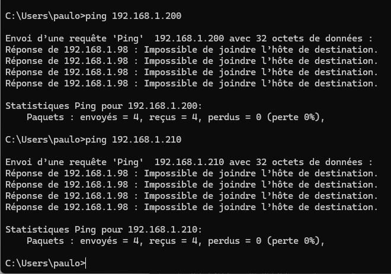

**Lecture du résultat :** la réponse « Impossible de joindre l'hôte de destination »
vient du **poste lui-même** (192.168.1.98), pas de l'adresse testée. Le poste a demandé
sur le réseau « qui a l'adresse 192.168.1.210 ? » (requête **ARP**) et personne n'a
répondu : **l'adresse est libre**.

> **Attention au piège :** Windows affiche « reçus = 4, perte 0 % » parce qu'il a bien
> reçu 4 messages d'erreur. Ce n'est pas une réponse de l'appareil testé. Une adresse
> occupée répondrait « Réponse de 192.168.1.210 : octets=32 temps=… ».

**Décision :** Proxmox (pve01) prendra l'adresse fixe **192.168.1.210/24**,
passerelle **192.168.1.254**, DNS **192.168.1.254**.


### 3.3 Téléchargement et vérification de l'image d'installation

**Source officielle :** https://www.proxmox.com/en/downloads → Proxmox Virtual Environment.

| Ligne proposée | Décision |
| --- | --- |
| For ARM64: Proxmox VE 9.2 ISO Installer | Écartée : réservée aux processeurs ARM |
| **Proxmox VE 9.2 ISO Installer (9.2-1, 1,71 Go)** | **Retenue** : processeur Intel x86_64 du mini PC |
| Proxmox VE 8.4 ISO Installer | Écartée : ancienne génération |

> **À retenir :** x86_64 (aussi appelé amd64) et ARM sont deux familles de processeurs
> incompatibles. « amd64 » ne veut pas dire « réservé à AMD » : Intel l'utilise aussi.

**Pourquoi vérifier l'empreinte (SHA256) :** elle prouve que le fichier téléchargé est
identique à celui publié par l'éditeur : ni abîmé pendant le téléchargement, ni modifié
par un tiers. En entreprise, on vérifie toujours une image système avant de l'installer.

**Commande Windows :**

```
certutil -hashfile proxmox-ve_9.2-1.iso SHA256
```

| | Empreinte SHA256 |
| --- | --- |
| Publiée par Proxmox | `4e88fe416df9b527624a175f24c9aa07c714d3332afb1ee3dbf3879573ef2c6c` |
| Calculée sur le fichier | `4e88fe416df9b527624a175f24c9aa07c714d3332afb1ee3dbf3879573ef2c6c` |

**Résultat : identiques, l'image est intègre.** Taille du fichier : 1 706 178 560 octets.


### 3.4 Création de la clé USB d'installation

**Outil :** balenaEtcher (gratuit). Il copie l'image octet par octet sur la clé
et vérifie automatiquement la copie à la fin. Alternative : Rufus en mode « DD ».

1. Brancher une clé USB de 8 Go minimum (**tout son contenu sera effacé**).
2. balenaEtcher → **Flash from file** → `proxmox-ve_9.2-1.iso`.
3. **Select target** → la clé USB (vérifier sa taille pour ne pas viser un autre disque).
4. **Flash!** → accepter l'autorisation Windows → attendre « Flash Completed! ».

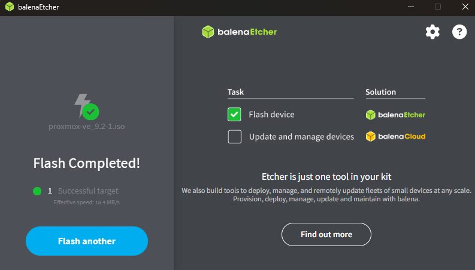

**Message Windows normal après la copie :** « Vous devez formater le disque… ».
**Cliquer sur Annuler.** Windows ne sait pas lire le format de la clé Proxmox ;
formater détruirait l'image qu'on vient de copier. Le message peut apparaître
plusieurs fois (une par partition de la clé) : Annuler à chaque fois.

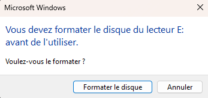


## 4. Préparation du BIOS

### 4.1 Entrer dans le BIOS et relever le matériel

Brancher écran, clavier, câble réseau (vers la box) et clé USB, puis allumer en
appuyant plusieurs fois sur **Suppr** (Del). Le BIOS du mini PC est un **AMI Aptio**.

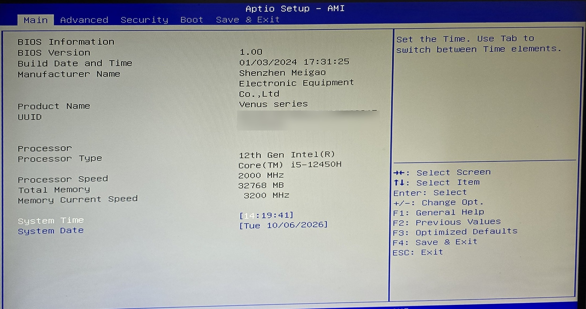

| Élément | Valeur relevée | Remarque |
| --- | --- | --- |
| BIOS | AMI Aptio, version 1.00 (01/03/2024) | Fabricant de la carte : Shenzhen Meigao |
| Processeur | Intel Core i5-12450H (12e génération) | Architecture x86_64 : bonne ISO |
| Mémoire | 32 768 Mo à 3 200 MHz | 32 Go confirmés |
| Heure système | 14:19 pour 16:19 heure de Paris | Horloge en **UTC** : c'est ce qu'attend Linux, ne pas la changer |

> **Pourquoi ne pas corriger l'heure :** Linux (donc Proxmox) considère que l'horloge
> matérielle est en temps universel (UTC) et ajoute lui-même le fuseau horaire.
> L'horloge réglée en heure de Paris décalerait Proxmox de 2 heures.


### 4.2 Réglages vérifiés et modifiés (onglet Advanced)

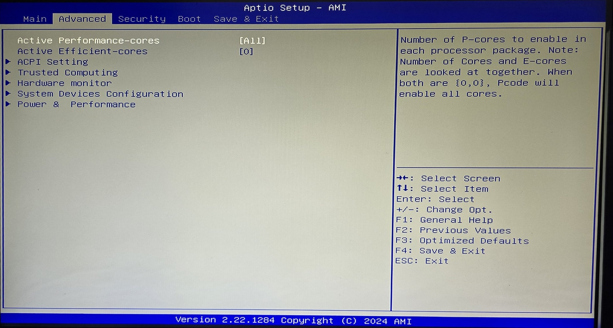

| Menu | Réglage | Avant | Après | Pourquoi |
| --- | --- | --- | --- | --- |
| Advanced | Active Performance-cores | All | All | Les 4 cœurs performance actifs |
| Advanced | **Active Efficient-cores** | **0** | **All** | Les 4 cœurs efficaces étaient coupés : on passe de 8 à 12 threads pour les VM |
| System Devices Configuration | VT-d | Enabled | Enabled | Permet de confier un équipement physique à une VM (passthrough) |
| System Devices Configuration | SR-IOV Support | Disabled | Disabled | Partage d'une carte réseau entre VM : inutile ici |
| System Devices Configuration | SATA Controller(s) | Enabled | Enabled | Indispensable pour le futur SSD de sauvegarde |
| System Devices Configuration | Network Stack | Disabled | Disabled | Démarrage par le réseau (PXE) : inutile ici |
| Power & Performance | Limites de puissance (PL1 0, PL2 64 W) | — | Inchangées | Valeurs du fabricant, adaptées au refroidissement du boîtier |

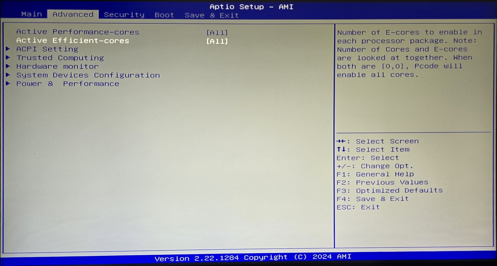
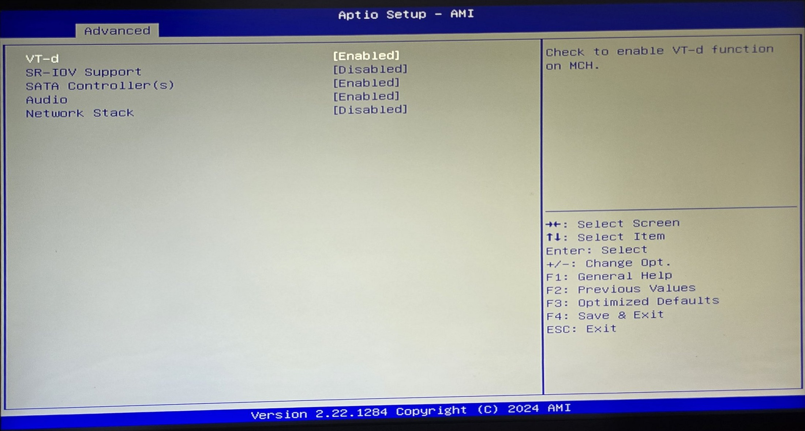
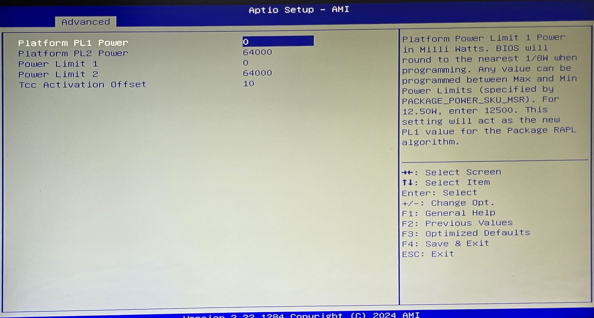

> **Bon réflexe :** un réglage du BIOS se vérifie toujours, même sur une machine
> « neuve ». Ici, la moitié des cœurs étaient désactivés sans que rien ne l'indique.

**VT-x (virtualisation du processeur) :** ce BIOS n'affiche pas d'option VT-x.
Sur ce type de mini PC, elle est activée par défaut et masquée. Vérification
prévue après l'installation : l'installateur Proxmox affiche un avertissement
« No support for KVM virtualization detected » si elle est désactivée.


## 5. Installation

### 5.1 Choix dans l'installateur

| Écran | Choix | Pourquoi |
| --- | --- | --- |
| Disque cible | /dev/nvme0n1 (SSD Kingston 512 Go, 476,94 GiB) | Seul disque interne ; la clé d'installation est exclue d'office |
| Système de fichiers | ext4 (+ LVM-thin pour les VM) | Un seul disque : ZFS perdrait son intérêt (redondance) et consommerait la RAM des VM |
| Tailles (swap, root, minfree, maxvz) | Automatiques | Valeurs calculées par Proxmox, adaptées à la taille du disque |
| Pays / fuseau / clavier | France / Europe/Paris / fr | Heure juste dans les journaux, clavier AZERTY en console |
| Mot de passe root | 12 caractères minimum, rangé dans un gestionnaire de mots de passe | Jamais dans une capture, un document ou une conversation |
| E-mail | Adresse de l'administrateur | Reçoit les alertes du serveur (sauvegardes ratées, disques) |
| Interface | nic0 (Intel 2,5 Gb/s, pilote igc), MAC 58:47:ca:xx:xx:xx (masquée) | Le port où le câble est branché (point vert) |
| Nom | pve01.lab.home.arpa | Convention « rôle + numéro » ; home.arpa est réservé aux réseaux privés (RFC 8375) |
| Adresse IP | 192.168.1.210/24, passerelle et DNS 192.168.1.254 | IP fixe hors plage DHCP, vérifiée libre |
| Pin network interface names | Coché | Les noms des cartes restent fixes après les mises à jour |
| Redémarrage automatique | Décoché | Retirer la clé USB avant de redémarrer, sinon on relance l'installateur |

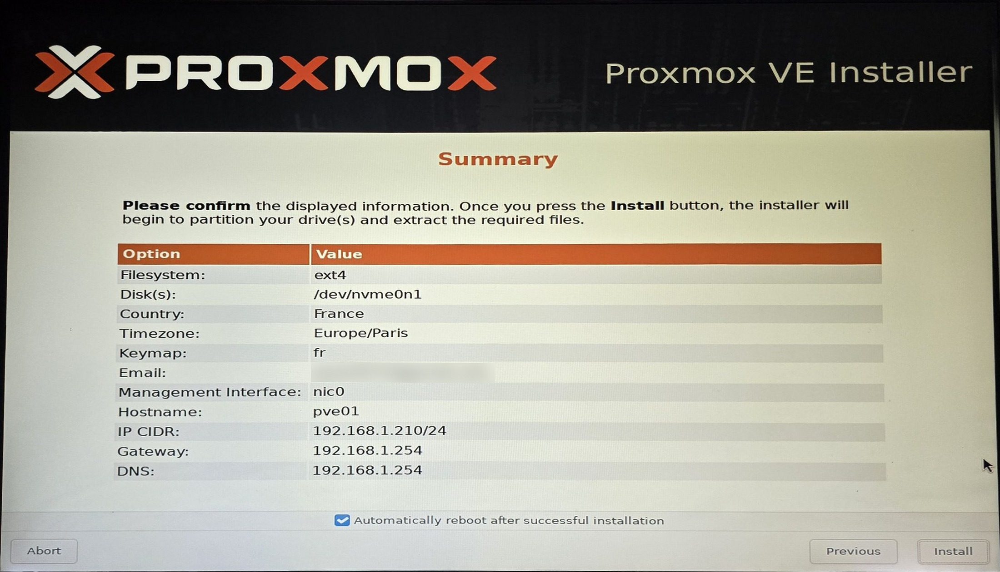

> **Formatage :** l'installateur efface la table de partitions et recrée tout
> (partition EFI, puis LVM avec swap, root en ext4 et data en LVM-thin).
> C'est un effacement rapide : pour recycler un disque en entreprise, on fait
> un effacement sécurisé (blkdiscard, secure erase) et on le trace.

> **Note :** au deuxième essai, l'installateur a pré-rempli une adresse IPv6
> fournie par la box. On a remis les valeurs IPv4 prévues. Les captures contenant
> l'IPv6 publique ne sont pas publiées.

## 6. Dépannage rencontré : plantage pendant l'installation

**Symptômes :**

1. Premier essai : clic sur Install, retour immédiat au menu de l'installateur.
2. Deuxième essai : la barre de progression démarre, puis vers 25 % écran noir et
   redémarrage brutal de la machine, suivi d'une erreur de démarrage.

**Diagnostic (méthode) :**

- Un redémarrage brutal sans message de Proxmox = plantage matériel, pas une erreur du logiciel.
- La machine fonctionnait avant avec l'ancien Proxmox.
- **Règle d'or : le dernier changement est le premier suspect.** Seul changement
  important avant l'installation : activation des cœurs efficaces (E-cores) dans le BIOS.
- Suspect secondaire : le pilote graphique de l'installateur avec les processeurs Intel de 12e génération.

**Correction :** retour à la configuration connue comme stable (Active Efficient-cores = 0),
puis nouvelle installation, **toujours en mode graphique** (un seul changement).
**Résultat : installation réussie.** Le mode graphique est donc mis hors de cause :
**le coupable est l'activation des E-cores** sur ce BIOS (version 1.00 de 2024).

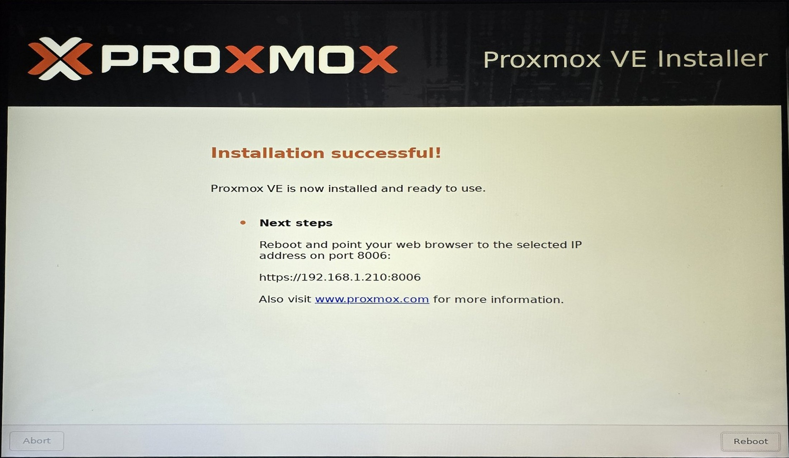

**À faire plus tard :** réactiver les E-cores une fois Proxmox installé, puis lancer
un test de charge pour vérifier si la machine reste stable. Un seul changement à la fois.

> **En entretien :** « Mon installation plantait. J'ai appliqué la règle du dernier
> changement, je suis revenu à la configuration stable, l'installation est passée.
> Ensuite, j'ai testé le changement isolément, sous charge. »


## 7. Premier démarrage et première connexion

Retirer la clé USB, puis redémarrer. La console du serveur indique l'adresse
d'administration ; on n'a plus besoin de l'écran du serveur : tout se fait à distance.

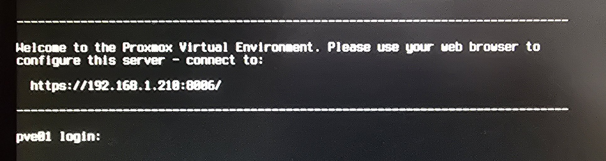

**Vérification réseau depuis le poste d'administration :** `ping 192.168.1.210`.

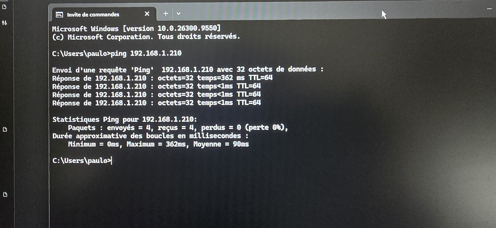

- Cette fois, c'est bien le serveur qui répond.
- Premier ping plus lent (362 ms) : le temps de la résolution ARP, ensuite mise en cache.
- **TTL=64** : valeur de départ typique de Linux (Windows : 128). Un simple ping donne un indice sur le système en face.

**Connexion web :** `https://192.168.1.210:8006` (8006 = port de l'interface Proxmox).

| Écran | Action | Explication |
| --- | --- | --- |
| « Votre connexion n'est pas privée » (NET::ERR_CERT_AUTHORITY_INVALID) | Paramètres avancés → Continuer | Certificat **auto-signé** : chiffré, mais non vérifié par une autorité. Remplacé plus tard par un certificat de l'entreprise |
| Connexion | root / Linux PAM standard authentication / Français | PAM = comptes système Linux |
| « Aucun abonnement en cours de validité » | OK | Version gratuite, sans support payant |

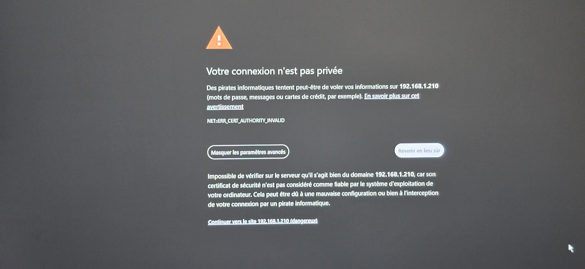
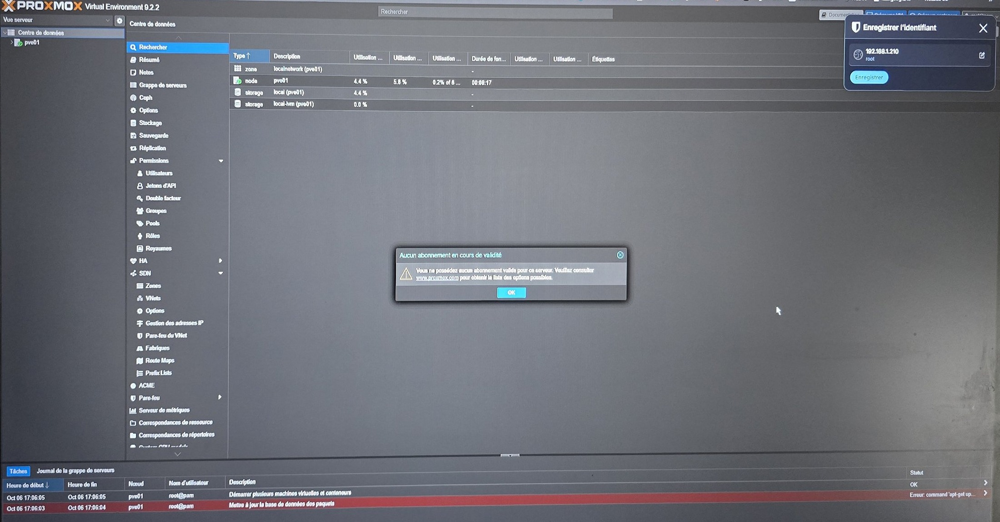

| Élément de l'interface | Rôle |
| --- | --- |
| Centre de données → pve01 | Le serveur (un seul nœud pour l'instant) |
| local (pve01) | Fichiers : ISO, modèles, sauvegardes |
| local-lvm (pve01) | Disques des VM (LVM-thin) |

## 8. Dépôts et mises à jour

**Problème constaté :** tâche en erreur « Mettre à jour la base de données des paquets »
(`apt-get update` failed). Cause : les dépôts **Enterprise** sont activés par défaut
et refusent l'accès sans abonnement. Un serveur qui ne peut pas se mettre à jour est
un risque de sécurité.

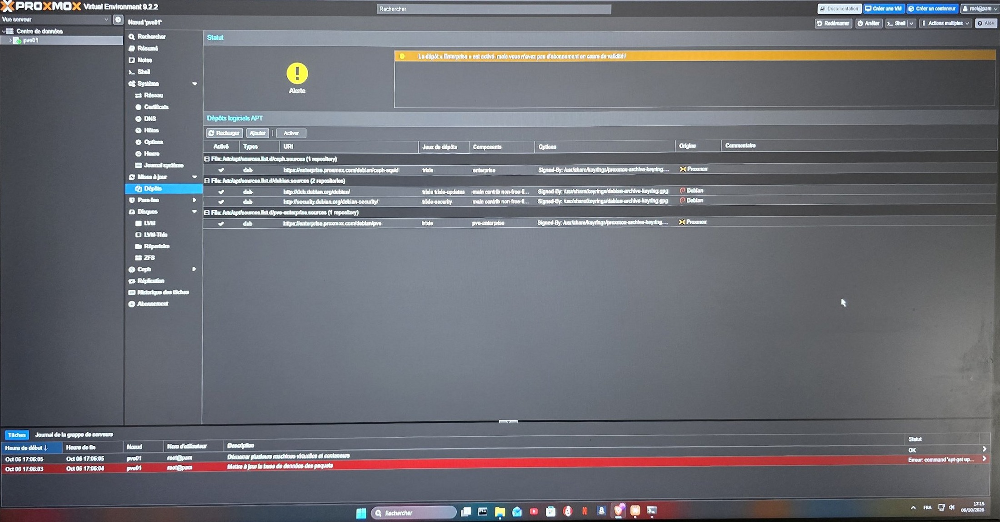

| Dépôt | Origine | Décision |
| --- | --- | --- |
| ceph-squid (enterprise) | Proxmox, payant | Désactivé : payant, et Ceph non utilisé |
| trixie, trixie-updates | Debian | Conservé : base du système |
| trixie-security | Debian | Conservé : correctifs de sécurité |
| pve-enterprise | Proxmox, payant | Désactivé |
| **pve-no-subscription** | Proxmox, gratuit | **Ajouté** (pve01 → Mises à jour → Dépôts → Ajouter) |

> **Enterprise ou No-Subscription :** mêmes logiciels. Les paquets Enterprise sont
> testés plus longtemps avant publication (ce que paient les entreprises, avec le support).
> No-Subscription convient à un lab ; en production, on prend l'abonnement.

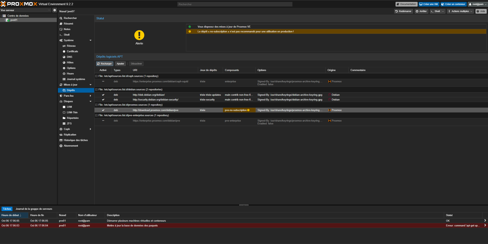

**Mise à jour :** Mises à jour → **Rafraîchir** (`apt update` : met à jour le catalogue),
puis **Mettre à niveau** (`apt dist-upgrade` : installe, et peut ajouter ou retirer
des paquets si nécessaire, par exemple un nouveau noyau).

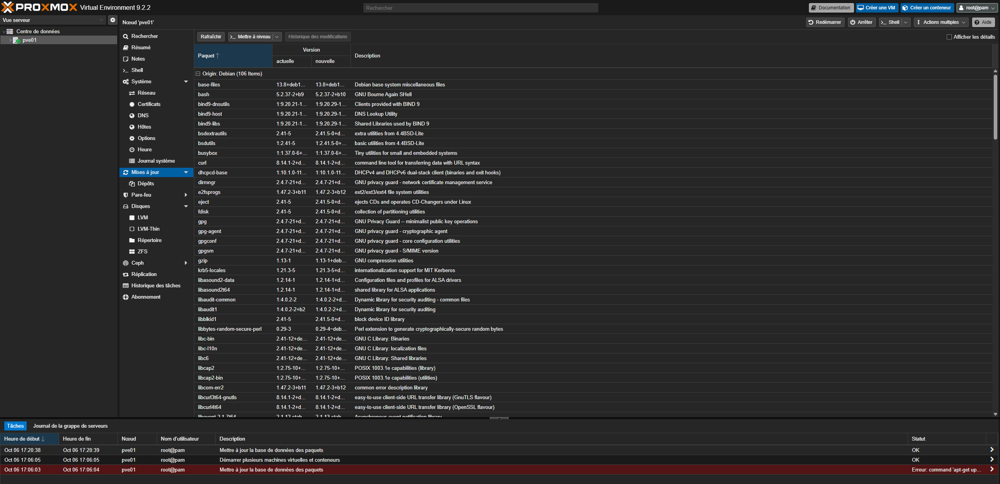

Pendant la mise à niveau, **apt-listchanges** affiche les changements importants
(ici : rsync plus strict sur la sécurité). On lit, puis `q` pour continuer.
En production, ces notes se lisent : un changement de comportement peut casser un script.

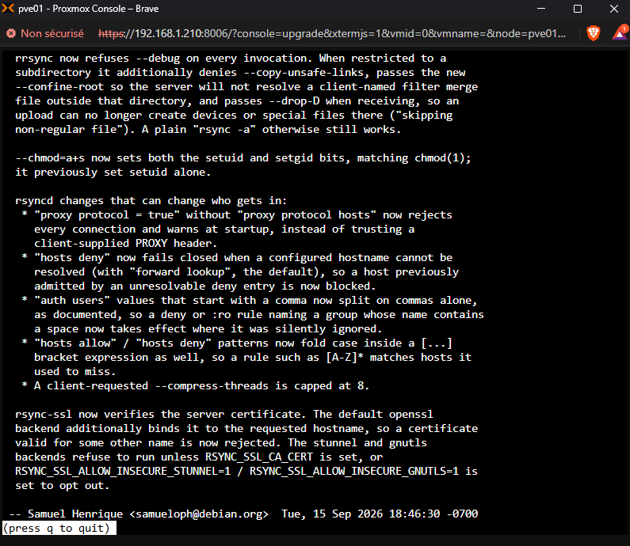

**Résultat :** « Your System is up-to-date ». Un **nouveau noyau** a été installé
(initrd 7.0.14-20-pve) : **redémarrage nécessaire** pour l'activer.

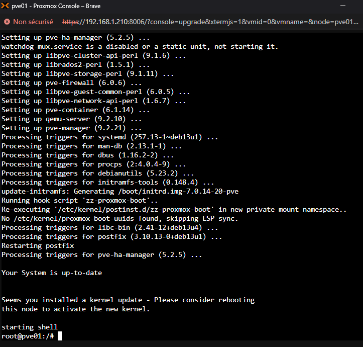


## 9. Redémarrage et vérification finale

1. pve01 → **Redémarrer** (en production : redémarrage planifié, utilisateurs prévenus, hors heures ouvrées).
2. Dans le BIOS, **NVMe remis en premier** au démarrage : un serveur démarre toujours sur son propre disque,
   même si une clé USB reste branchée.

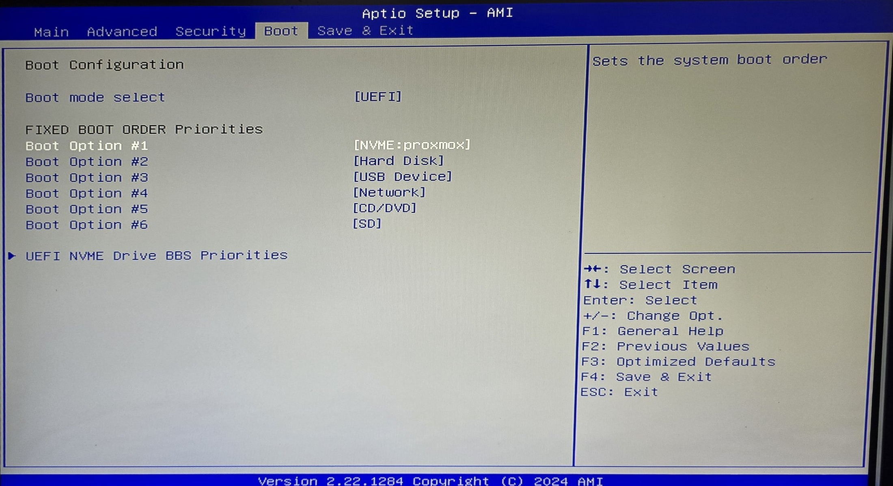

3. pve01 → **Résumé** : contrôle de l'état du serveur.

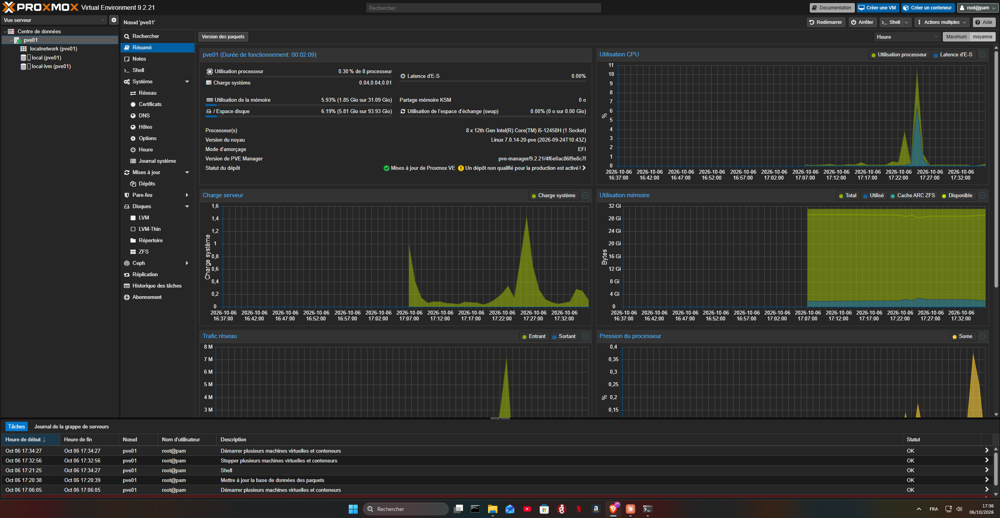

| Contrôle | Valeur | Verdict |
| --- | --- | --- |
| Version du noyau | Linux 7.0.14-20-pve | Nouveau noyau actif |
| Version de PVE Manager | pve-manager/9.2.21 | À jour |
| Processeurs | 8 × Intel Core i5-12450H (1 socket) | 4 cœurs performance × 2 threads (E-cores désactivés, voir dépannage) |
| Mémoire | 31,09 Gio | 32 Go installés |
| Disque système (/) | 93,93 Gio | Le reste du SSD est dans local-lvm pour les VM |
| Swap | 8 Gio | Taille automatique |
| Mode d'amorçage | EFI | Démarrage UEFI moderne |
| Statut du dépôt | Mises à jour disponibles + avertissement no-subscription | Attendu |


## 10. Sécurisation des accès

**Principes appliqués :**

- **Les droits vont aux groupes, pas aux personnes** (contrôle d'accès par rôles, RBAC).
  Arrivée d'un admin : on l'ajoute au groupe. Départ : on le retire, tous ses droits partent d'un coup.
- **Moindre privilège** : chacun reçoit le minimum nécessaire.
- **Pas de travail quotidien en root** : chaque admin a son compte nominatif, pour
  savoir qui a fait quoi dans les journaux. Root devient un compte de secours (« break-glass »).
- **Double authentification (TOTP)** sur tous les comptes administrateurs.

### 10.1 Groupe et permission

Centre de données → Permissions → Groupes → Créer : **admin-infra**.
Puis Permissions → Ajouter → Permission de groupe :

| Chemin | Groupe | Rôle | Propager |
| --- | --- | --- | --- |
| `/` (tout Proxmox) | @admin-infra (@ = groupe) | Administrator | Oui |

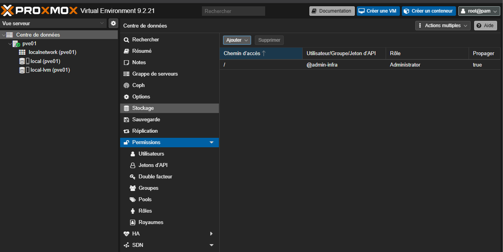

### 10.2 Compte nominatif

Permissions → Utilisateurs → Ajouter : **paulo**, royaume **Proxmox VE authentication server**,
mot de passe distinct de root, groupe **admin-infra**. Identifiant : `paulo@pve`.

| Royaume | Nature du compte | Choix |
| --- | --- | --- |
| Linux PAM (`@pam`) | Vrai compte Linux, peut aussi ouvrir une session système | Réservé à root |
| Proxmox VE (`@pve`) | Existe uniquement dans Proxmox, sans accès direct au système | **Retenu** pour les admins |

> Les champs « Mot de passe » n'apparaissent qu'avec le royaume Proxmox VE :
> avec PAM, c'est le mot de passe du compte Linux qui est utilisé.

**Test en navigation privée** (on garde la session root ouverte) :

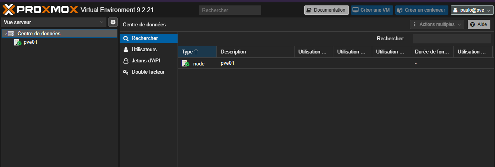

**Dépannage :** le compte se connecte, mais menu réduit et boutons « Créer une VM » grisés.
Le compte n'avait **aucun droit** : il n'avait pas été ajouté au groupe à la création.
**Correction :** Utilisateurs → paulo@pve → Modifier → Groupe = admin-infra, puis reconnexion.

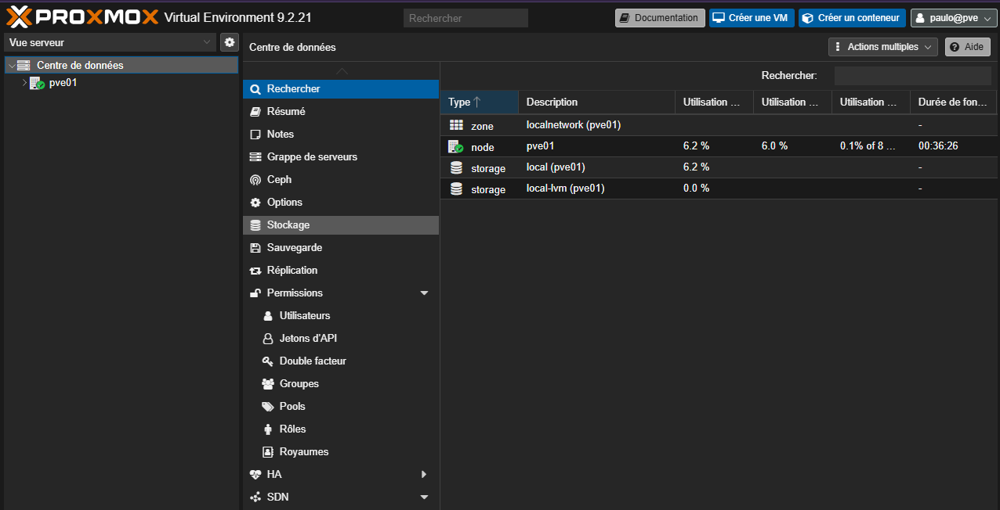

> **Bon réflexe :** on teste toujours un compte après l'avoir créé, avec le compte lui-même.

### 10.3 Double authentification

Permissions → Double facteur → Ajouter :

1. **TOTP** : scanner le QR code avec une application d'authentification, valider avec le code à 6 chiffres.
   **Ne jamais faire de capture du QR code** : il contient la clé secrète.
2. **Recovery Keys** : codes de secours à usage unique, affichés une seule fois,
   rangés dans le gestionnaire de mots de passe.
3. Test de reconnexion **avant** de fermer la dernière session admin ouverte.

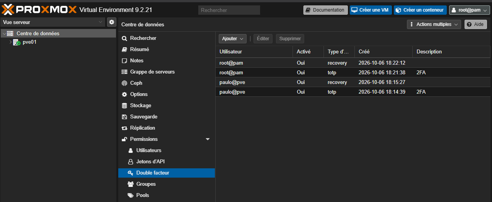

> **Accès de dernier recours :** la 2FA protège l'interface web. La console physique
> du serveur (écran et clavier) reste utilisable avec root en cas de perte du téléphone et des codes.

## 11. Recette (validation de la brique)

| # | Test | Résultat attendu | Résultat |
| --- | --- | --- | --- |
| 1 | `ping 192.168.1.210` depuis le poste admin | Réponses du serveur | OK |
| 2 | `https://192.168.1.210:8006` | Page de connexion Proxmox | OK |
| 3 | pve01 → Résumé | Noyau 7.0.14-20-pve, 31 Gio RAM, EFI | OK |
| 4 | Mises à jour → Rafraîchir | Tâche OK, aucune erreur de dépôt | OK |
| 5 | Redémarrage | Démarre sur le NVMe, console affiche l'URL | OK |
| 6 | Connexion `paulo@pve` | Interface complète, droits administrateur | OK (après correction) |
| 7 | Connexion `paulo@pve` puis `root@pam` | Code TOTP demandé | OK |

## 12. Utilisation en entreprise : 3 cas concrets

1. **Un nouvel admin arrive.** Création de son compte `@pve`, ajout au groupe admin-infra,
   il configure sa 2FA à sa première connexion. Aucun droit à donner un par un.
2. **Une alerte de sécurité Debian tombe.** pve01 → Mises à jour → Rafraîchir, lecture des
   notes de changement, mise à niveau. Si un nouveau noyau est installé, redémarrage planifié
   hors heures ouvrées, utilisateurs prévenus.
3. **Un admin quitte l'entreprise.** Désactivation immédiate de son compte (Utilisateurs →
   Modifier → Activé décoché), suppression de sa 2FA, puis suppression du compte après vérification.
   Les journaux gardent la trace de ses actions passées.

## 13. Questions d'entretien

- **Pourquoi Proxmox plutôt que VMware ?** Gratuit, complet, très demandé depuis la hausse
  des tarifs VMware après le rachat par Broadcom. Je connais aussi le principe d'Hyper-V.
- **ext4 ou ZFS ?** Ça dépend du matériel : ZFS en miroir sur plusieurs disques sans carte RAID,
  LVM-thin sur un RAID matériel, Ceph ou stockage partagé en cluster. Sur un seul disque,
  ext4 + LVM-thin pour garder la RAM pour les VM. Jamais ZFS sur un RAID matériel.
- **Pourquoi pas root au quotidien ?** Traçabilité (qui a fait quoi), moindre privilège,
  et root est la cible n°1 des attaques.
- **Enterprise ou No-Subscription ?** Mêmes logiciels ; Enterprise est testé plus longtemps
  et inclut le support. No-Subscription pour un lab, abonnement en production.
- **Ton installation a planté, qu'as-tu fait ?** Règle du dernier changement : retour à la
  configuration stable (E-cores désactivés), un seul changement à la fois, cause confirmée.

## 14. Points en suspens

- Retester l'activation des E-cores sous charge (ou après une mise à jour du BIOS).
- Remplacer le certificat auto-signé par un certificat de l'entreprise (après la brique Active Directory).
- Réseau : créer le pont virtuel (VLAN-aware) pour pfSense et les VLAN → brique 01.
