# Brique 01 — Pare-feu pfSense et découpage du réseau en VLAN

> Procédure d'intervention rédigée comme chez un client : chaque étape indique
> **quoi faire**, **pourquoi**, **comment vérifier** et **quoi faire si ça échoue**.

## 1. Besoin du client

La PME a besoin d'une **seule porte** entre Internet et son réseau, et de **séparer**
ses machines par usage : les serveurs, les postes, le Wi-Fi des salariés, le Wi-Fi
des invités et l'administration ne doivent pas tous se voir. Un invité sur le Wi-Fi
ne doit jamais atteindre un serveur ; un poste infecté ne doit pas toucher aux
équipements réseau.

On installe un **pare-feu** qui route et filtre entre plusieurs **VLAN** (réseaux
virtuels séparés sur le même câblage).

## 2. Choix de la techno

| Critère | pfSense CE | OPNsense | Pare-feu de la box |
| --- | --- | --- | --- |
| Présence en PME et ESN | Très répandu | En hausse | Inadapté |
| VLAN, VPN, règles fines | Oui | Oui | Non |
| Coût | Gratuit | Gratuit | Inclus |
| Téléchargement | Via l'installateur Netgate (compte gratuit) | ISO direct | — |

**Choix retenu : pfSense CE**, le plus rencontré chez les clients et en entretien.
Il tourne ici en **machine virtuelle** sur Proxmox (brique 00).

## 3. Architecture cible

```
            INTERNET
               |
         [ Freebox ] 192.168.1.254       réseau de la box 192.168.1.0/24
               |
     nic0 -> [ vmbr0 ] -- Proxmox 192.168.1.210
               |
          WAN 192.168.1.211
          [ fw01 : pfSense ]   le seul passage entre la box et l'entreprise
          vtnet1 = trunk 802.1Q (tous les VLAN)
               |
     nic1 -> [ vmbr1 ] (VLAN aware, sans IP)  -> switch Cisco (brique 02)
               |
   VLAN 10       VLAN 20       VLAN 30        VLAN 40        VLAN 99
   Serveurs      Postes        Wi-Fi salariés Wi-Fi invités  Administration
   .10.254       .20.254       .30.254        .40.254        .99.254
```

Toutes les adresses : [plan d'adressage](../docs/plan-adressage.md). Dans chaque VLAN,
le 3e nombre de l'adresse est le numéro du VLAN et pfSense est la passerelle en `.254`.

## 4. Préparation

### 4.1 Récupérer et vérifier l'installateur

Depuis la version 2.8, pfSense CE s'installe avec le **Netgate Installer**, récupéré
gratuitement (panier à 0 €) sur la boutique Netgate. Version ISO AMD64.

Le fichier arrive compressé (`.iso.gz`). On teste l'archive (`gzip -t`), on la décompresse,
puis on calcule l'empreinte SHA-256 de l'ISO.

**Pourquoi :** une ISO abîmée pendant un transfert peut faire planter l'installation au
milieu, et on chercherait la panne au mauvais endroit.

### 4.2 Envoyer l'ISO dans Proxmox avec contrôle d'intégrité

`local (pve01)` → **Images ISO** → **Téléverser**, avec **SHA-256** et l'empreinte calculée.
Proxmox recalcule l'empreinte après réception et refuse le fichier si elle diffère.

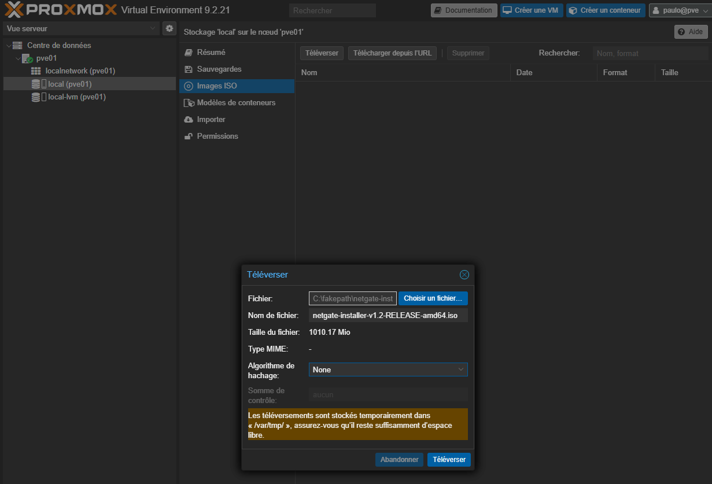
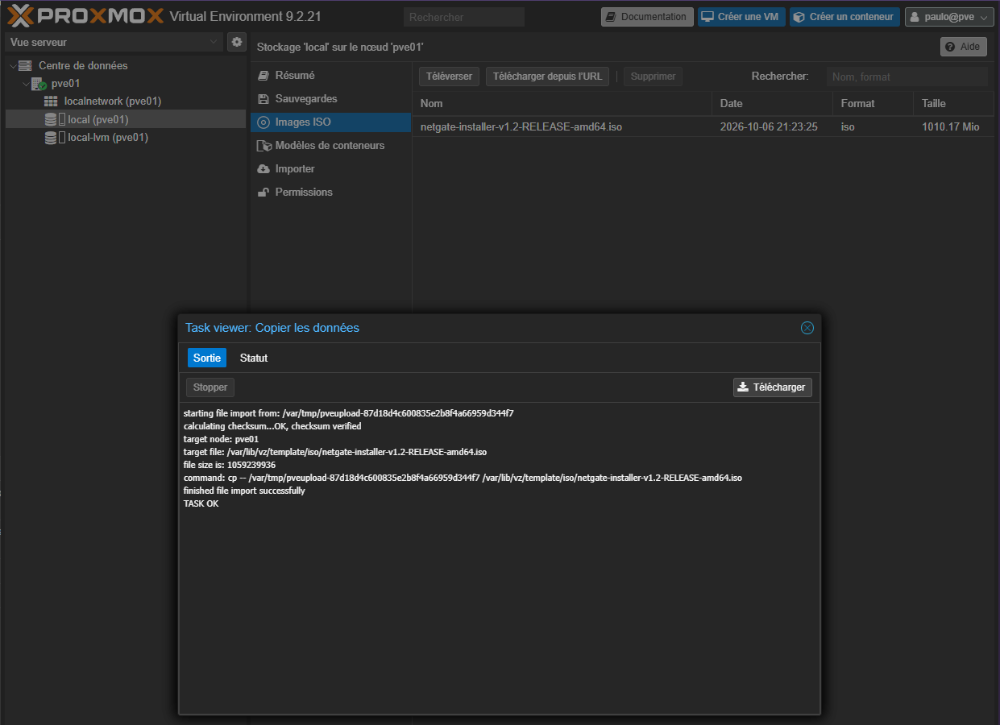

**Vérification :** la tâche affiche `checksum verified` puis `TASK OK`.

## 5. Réseau de Proxmox : le pont vmbr1

Le mini PC a deux cartes : **nic0** (déjà reliée à vmbr0, côté box) et **nic1** (libre).
On crée un pont **vmbr1** sur nic1 pour le réseau de l'entreprise.

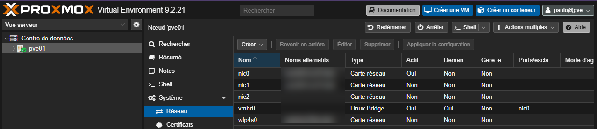

| Champ | Valeur | Pourquoi |
| --- | --- | --- |
| Nom | vmbr1 | Suite logique de vmbr0 |
| IPv4 / passerelle | vides | Proxmox ne doit pas être joignable depuis le réseau de l'entreprise |
| Gère les VLAN | coché | Un seul pont pour tous les VLAN : chaque VM reçoit juste un tag |
| Ports du pont | nic1 | Le câble qui partira vers le switch Cisco |

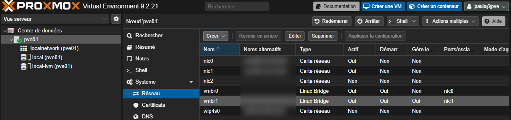

**Alternative écartée :** un pont par VLAN (vmbr10, vmbr20…). Plus lourd : chaque nouveau
VLAN obligerait à modifier le réseau de l'hôte.

## 6. Création de la VM fw01

| Réglage | Valeur | Pourquoi |
| --- | --- | --- |
| ID / nom | 100 / fw01 | La centaine pour l'infrastructure réseau |
| Démarrage | automatique, ordre 1, délai 30 s | Le pare-feu démarre en premier ; les autres VM attendent qu'il soit prêt |
| Type d'OS | Other | pfSense tourne sur FreeBSD, pas sur Linux |
| Machine / BIOS | q35 / SeaBIOS | Modèle récent, pas besoin d'UEFI |
| Disque | SCSI (VirtIO SCSI single), 16 Go, discard, SSD, IO thread | Bus rapide ; un pare-feu stocke peu |
| Processeur | 2 cœurs, type host | Accès aux instructions AES-NI (chiffrement, VPN) |
| Mémoire | 2 Go, ballooning désactivé | Le ballooning fonctionne mal sous FreeBSD |
| net0 | VirtIO sur vmbr0, pare-feu Proxmox décoché | WAN, côté box |
| net1 | VirtIO sur vmbr1, **sans tag** | Trunk : la carte reçoit tous les VLAN |

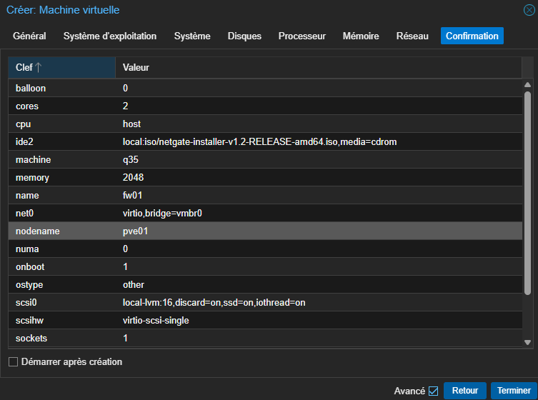
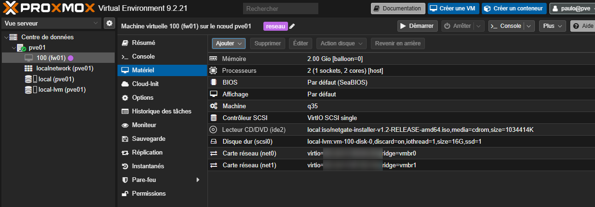

**Piège évité :** avec le type « Other », Proxmox propose par défaut un disque IDE et une
carte Intel E1000, lents. On passe sur SCSI et VirtIO.

## 7. Installation

1. **Install**, puis carte WAN = **vtnet0**. On vérifie par l'adresse MAC que vtnet0 est bien
   net0 (vmbr0) : les noms changent d'un système à l'autre, la MAC jamais.
2. WAN laissé en DHCP le temps de passer à l'écran suivant.
3. **LAN configuré avant le WAN** (voir le dépannage 9.1) : carte vtnet1, **VLAN 99**,
   10.10.99.254/24, DHCP de .100 à .199.
4. WAN repassé en adresse fixe : 192.168.1.211/24, passerelle et DNS 192.168.1.254.
5. **Install CE**, système de fichiers **ZFS** (résiste aux coupures de courant, retour
   arrière après une mise à jour), partitions GPT, disque da0.
6. Version **pfSense CE 2.9.0** (la stable actuelle).

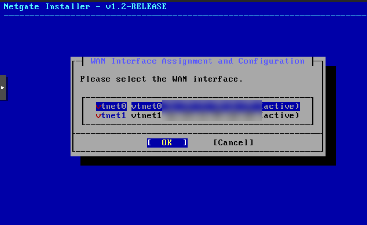
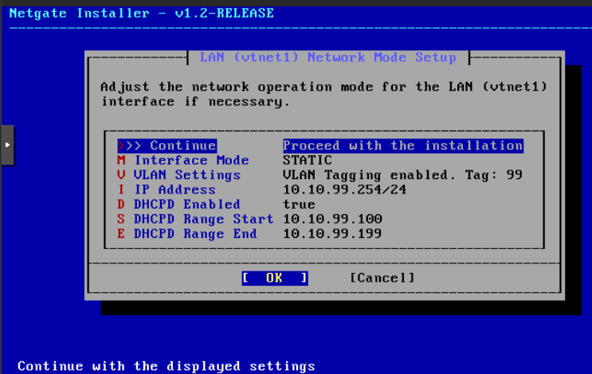
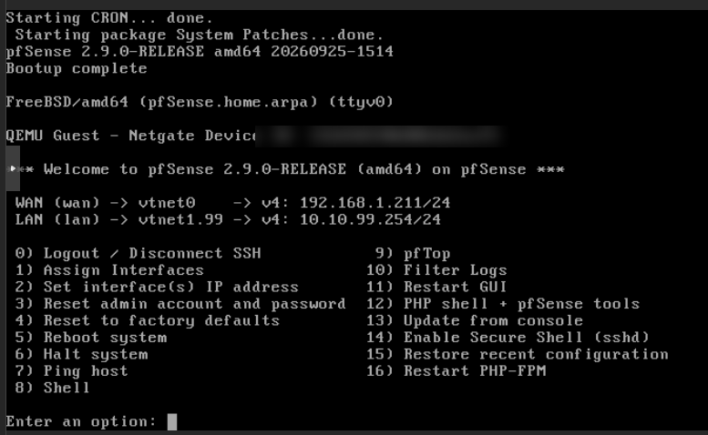

**Vérification :** le menu console affiche `WAN vtnet0 192.168.1.211/24` et
`LAN vtnet1.99 10.10.99.254/24` (`vtnet1.99` = la carte vtnet1, VLAN 99).

## 8. Recette réseau depuis la console

Option 7 (Ping host), du plus proche au plus loin :

| Test | Résultat | Ce que ça prouve |
| --- | --- | --- |
| `192.168.1.254` | 0 % de perte, 0,7 ms | WAN et vmbr0 fonctionnent |
| `1.1.1.1` | 0 % de perte, 4,8 ms | Passerelle et routage vers Internet |
| `netgate.com` | échec « UDP connect: Invalid argument » | Voir 9.3 |
| `drill netgate.com A` | NOERROR, 2 adresses, serveur 192.168.1.254 | Le DNS fonctionne |
| `ping -4 netgate.com` | 0 % de perte | Internet par nom, en IPv4 |

## 9. Dépannages rencontrés

### 9.1 « Cannot set WAN interface IP address »

**Symptôme :** l'installateur refuse l'adresse fixe 192.168.1.211/24 du WAN.

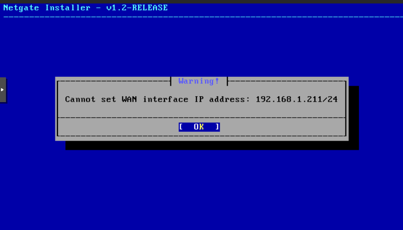

| Hypothèse | Test | Résultat |
| --- | --- | --- |
| Conflit d'adresse | `ping` + `arp -a` depuis un poste | Écartée : l'adresse est libre |
| Format `/24` refusé | Saisie sans /24 | Fausse piste : accepté, mais le masque devient /32 |
| **Chevauchement de réseaux** | LAN déplacé en 10.10.99.0/24, puis WAN en /24 | **Confirmée** |

**Cause :** le LAN par défaut de l'installateur est **192.168.1.1/24**, dans le même réseau
que le WAN. Un routeur ne peut pas avoir deux interfaces dans le même réseau.
**Correction :** configurer le LAN **avant** le WAN.

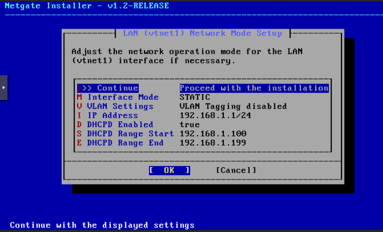

**Piège de lecture :** sous Windows, un ping vers une adresse libre affiche « Réponse de
192.168.1.98 : Impossible de joindre l'hôte » et « perte 0 % ». C'est le poste lui-même qui
répond : il faut lire les lignes, pas seulement les statistiques.

### 9.2 Le bouton Reboot de l'installateur ouvre un shell

L'affichage se fige. L'installation étant terminée (« Post Installation setup… done »),
on retire l'ISO puis on **réinitialise** la VM depuis Proxmox. ZFS encaisse la coupure.

### 9.3 Ping par nom en échec, DNS pourtant fonctionnel

Le nom est résolu en **IPv6** alors que pfSense n'a pas d'IPv6 configuré. `drill` prouve que
le DNS répond ; `ping -4` force l'IPv4 et fonctionne.

### 9.4 Masque /32 sur deux VLAN

Lors de la configuration des interfaces, le masque est resté sur **/32** (valeur par défaut
de la liste) pour POSTES et WIFI_SALARIES. Conséquence : aucun poste du VLAN n'aurait pu
joindre sa passerelle, et le DHCP refuserait de démarrer. Erreur repérée en **relecture**,
corrigée en /24, puis prouvée :

```
ifconfig | grep "inet 10."
inet 10.10.20.254 netmask 0xffffff00 broadcast 10.10.20.255
```

`0xffffff00` = 255.255.255.0 = /24.

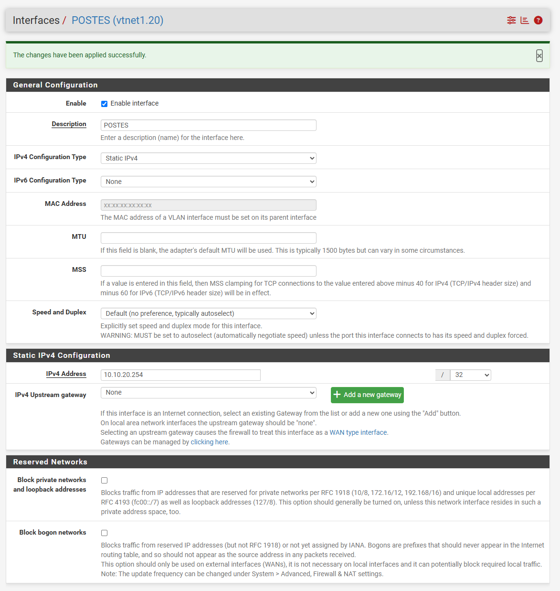
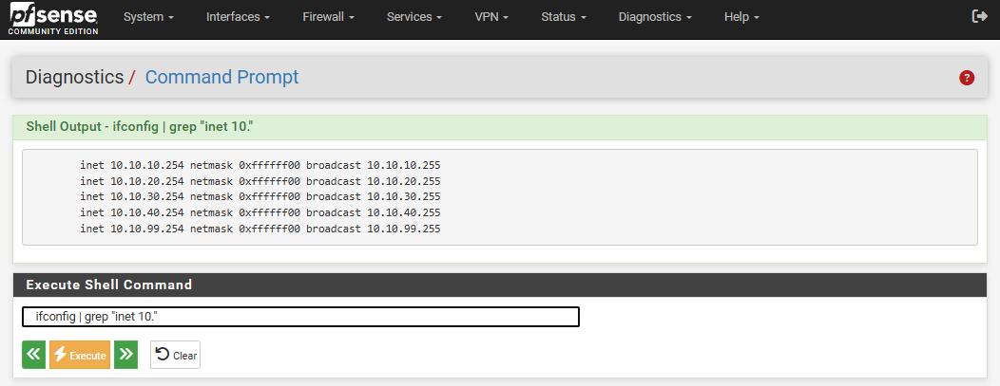

## 10. Accès à l'interface web

Le poste d'administration est sur le réseau de la box, côté WAN. Deux obstacles :
**le routage** (la box ne connaît pas les réseaux 10.10.x.0 cachés derrière pfSense) et
**le filtrage** (pfSense bloque tout ce qui arrive par le WAN).

**Accès temporaire, en attendant le switch :**

1. Console : `pfctl -d` désactive le filtrage le temps de se connecter (`pf disabled`).
2. `https://192.168.1.211`, alerte de certificat auto-signé acceptée.
3. Règle WAN : **Pass, TCP, source 192.168.1.98 (le seul poste admin), destination This
   Firewall, port 443**, journalisée, description `TEMP webGUI PC admin .98 - suppr. apres switch`.
4. **Apply** réactive le filtrage ; l'accès reste ouvert grâce à la règle.

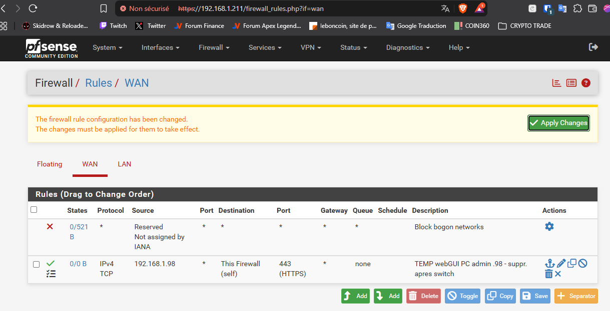

**Vérification du filtrage**, sans supposer : Diagnostics → Command Prompt →
`pfctl -s info | head -1` → `Status: Enabled`.

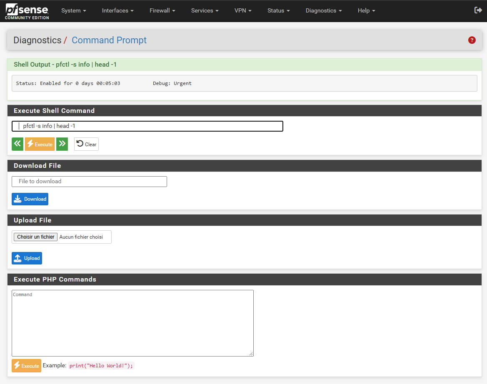

**À supprimer** quand le poste d'administration sera branché sur un port du VLAN 99.

## 11. Assistant de configuration

| Écran | Valeur | Pourquoi |
| --- | --- | --- |
| Hostname / Domain | fw01 / lab.home.arpa | Nom du rôle ; `home.arpa` est réservé aux réseaux privés (RFC 8375) |
| DNS | 192.168.1.254, 1.1.1.1 ; Override décoché | Le résolveur de pfSense interroge lui-même les serveurs racines |
| Fuseau | Europe/Paris | Journaux à l'heure réelle ; Kerberos (AD) refuse 5 min d'écart |
| Passerelle WAN | 192.168.1.254 | La route par défaut |
| Block RFC1918 | **décoché** sur le WAN | Le WAN est lui-même dans un réseau privé ; sinon le poste admin est bloqué |
| Block bogons | coché | Adresses qui ne doivent jamais exister |
| Mot de passe admin | changé | Le couple admin/pfsense est public |

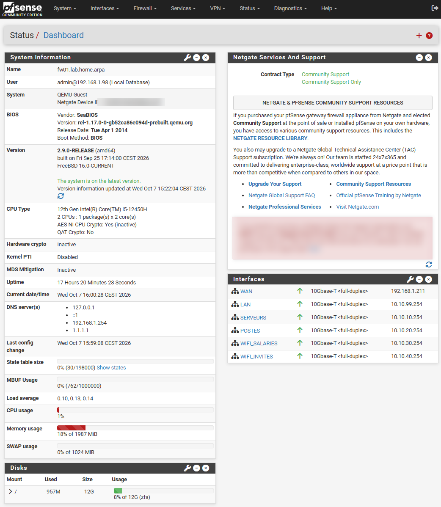

## 12. Les VLAN

1. **Interfaces → Assignments → VLANs** : parent **vtnet1**, tags 10, 20, 30, 40
   (type C-Tag 802.1Q). Le VLAN 99 existe déjà depuis l'installation, renommé ADMINISTRATION.
2. **Interface Assignments** : chaque VLAN ajouté (OPT1 à OPT4).
3. Chaque interface : activée, renommée, **Static IPv4 en .254/24**, IPv6 None,
   **passerelle None** (une interface interne n'a jamais de passerelle : pfSense est la
   passerelle de ce réseau).

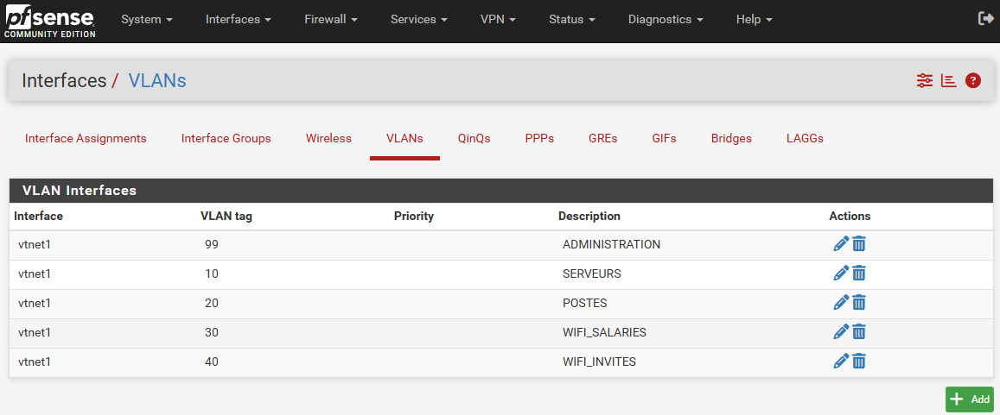
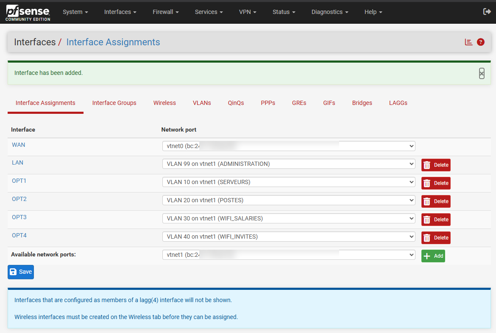

## 13. DHCP temporaire du VLAN Postes

En production, le DHCP des postes sera assuré par **Windows Server** (brique 03) : il inscrit
les postes dans le DNS de l'AD et leur donne l'AD comme DNS. Le DHCP étant un broadcast
qui ne traverse pas les routeurs, pfSense fera **relais DHCP** (`ip helper-address` chez Cisco).

En attendant : **Services → DHCP Server → POSTES**, plage **10.10.20.100 à .199**
(.1 à .99 réservés aux adresses fixes : imprimantes, équipements), bail de 2 h.

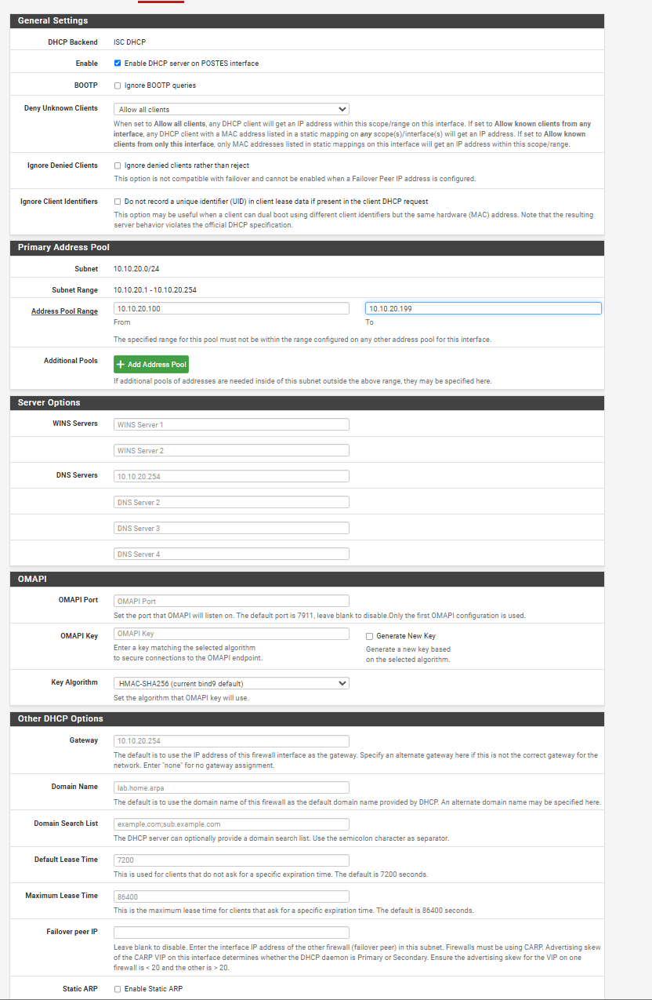

## 14. Règles du VLAN Postes

Sans règle, une interface bloque tout (refus par défaut). Les règles sont lues de haut en
bas et **la première qui correspond gagne** : les exceptions d'abord, la règle large ensuite.

| # | Action | Source | Destination | Port | Journal |
| --- | --- | --- | --- | --- | --- |
| 1 | Bloquer | POSTES subnets | LAN subnets (admin) | tout | oui |
| 2 | Bloquer | POSTES subnets | pfSense (This Firewall) | 443 | oui |
| 3 | Autoriser | POSTES subnets | tout | tout | non |

La règle 2 empêche un salarié d'ouvrir l'interface du pare-feu par sa propre passerelle
(10.10.20.254). On journalise ce qui est bloqué, pas le trafic normal.

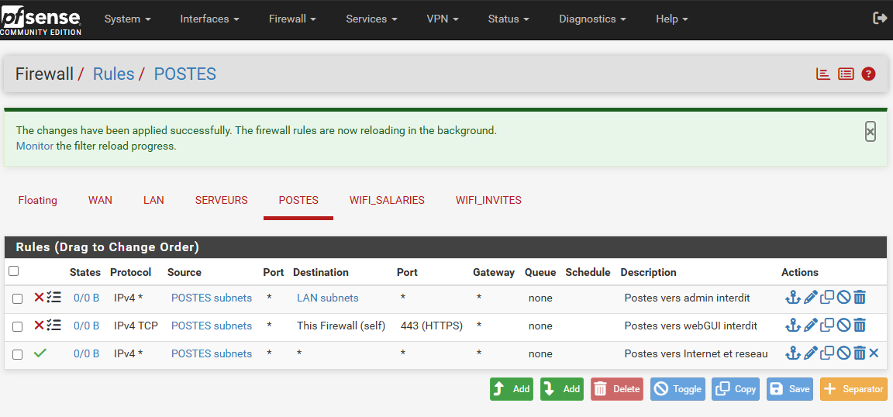

**Piège évité :** une règle se pose sur l'interface **d'où vient** le trafic. Posée sur
l'onglet LAN avec la source POSTES, elle ne bloquerait jamais rien, sans aucune erreur.

## 15. Recette de la segmentation

Une VM de test **Alpine Linux** (live, 67 Mo, sans disque) est branchée sur vmbr1 avec le
**tag 20**, comme un poste du VLAN Postes.

| Étape | Commande | Résultat |
| --- | --- | --- |
| Carte allumée | `ip link set eth0 up` | (éteinte par défaut en live : « Network is down ») |
| DHCP sans serveur | `udhcpc` | 5 « discover » sans réponse : échec attendu |
| DHCP avec serveur | `udhcpc` | Bail 10.10.20.100 obtenu de 10.10.20.254 (DORA) |
| Sans règle | `ping 10.10.20.254` | 100 % de perte : refus par défaut |
| Internet | `ping 1.1.1.1` | 0 % de perte |
| Internet + DNS | `ping google.com` | 0 % de perte |
| Administration | `ping 10.10.99.254` | **100 % de perte : bloqué** |
| Interface web | `nc 10.10.20.254 443` | **Pas de réponse : bloqué** |

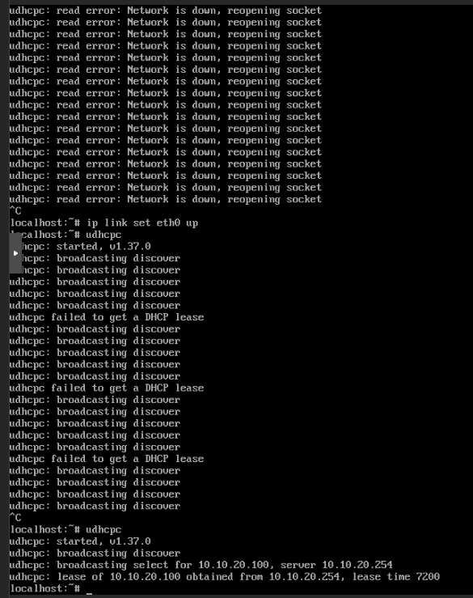
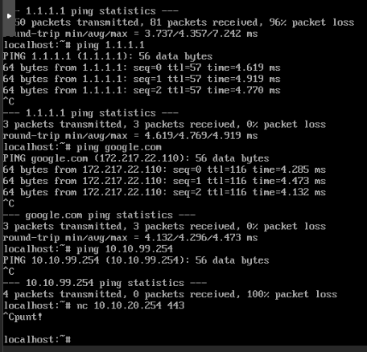

**DORA :** Discover (le poste cherche un serveur), Offer (pfSense propose une adresse),
Request (le poste l'accepte), Ack (pfSense confirme le bail).

## 16. Utilisation en entreprise : 3 cas concrets

1. **Un poste infecté** tente de scanner le réseau d'administration : la règle 1 le bloque
   et la tentative apparaît dans les journaux.
2. **Un invité** se connecte au Wi-Fi : il a Internet mais ne voit ni les serveurs ni les postes.
3. **Un nouveau salarié** branche son PC dans le VLAN Postes : il reçoit une adresse et hérite
   des règles du VLAN, sans aucune configuration sur le poste.

## 17. Questions d'entretien

- **Pourquoi des VLAN ?** Pour segmenter : chaque groupe de machines a son réseau, et le
  pare-feu contrôle ce qui passe de l'un à l'autre.
- **Qu'est-ce qu'un trunk ?** Un lien qui transporte plusieurs VLAN étiquetés (802.1Q).
  Avec un routeur qui route entre eux sur un seul lien : « router on a stick ».
- **Dans quel ordre sont lues les règles d'un pare-feu ?** De haut en bas, la première qui
  correspond gagne ; tout ce qui n'est pas autorisé est interdit.
- **Combien d'adresses utilisables dans un /24 ?** 254 : .0 est le réseau, .255 le broadcast.
- **Pourquoi le DHCP a-t-il besoin d'un relais entre VLAN ?** La demande est un broadcast,
  qui reste dans son VLAN. Le relais la transmet au serveur.
- **Comment dépanner un « ça ne passe pas » ?** Deux questions : le chemin existe-t-il
  (routage) ? Quelqu'un bloque-t-il (filtrage) ? Et on teste couche par couche.
- **Pourquoi une adresse fixe pour un pare-feu ?** Règles, VPN et documentation s'appuient
  sur son adresse : elle ne doit jamais changer.

## 18. Points en suspens

- Règles des VLAN Wi-Fi (30, 40) et Serveurs (10), avec des groupes d'interfaces :
  à faire avec la brique 02 (switch et borne Wi-Fi).
- Supprimer la règle WAN temporaire une fois l'accès par le VLAN 99 en place.
- Remplacer le DHCP temporaire par Windows Server + relais (brique 03).
- Réserver l'adresse du poste admin dans la box.
- Activer l'accélération AES-NI (System → Advanced) et SSH sécurisé.
- Mettre en place la sauvegarde de la configuration de pfSense.
